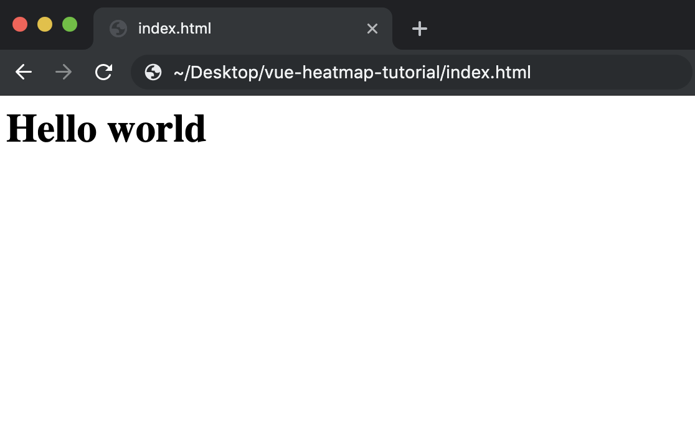
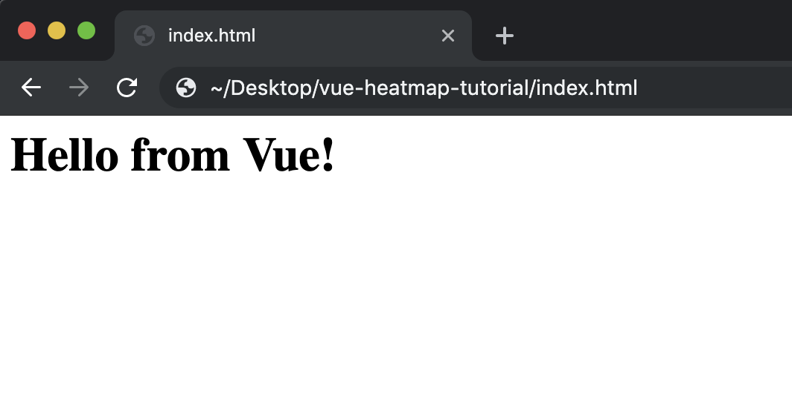
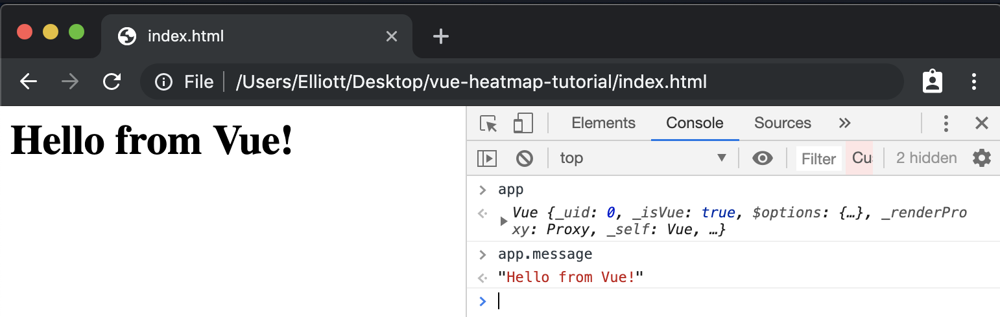
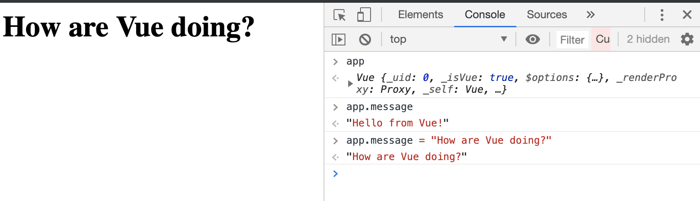
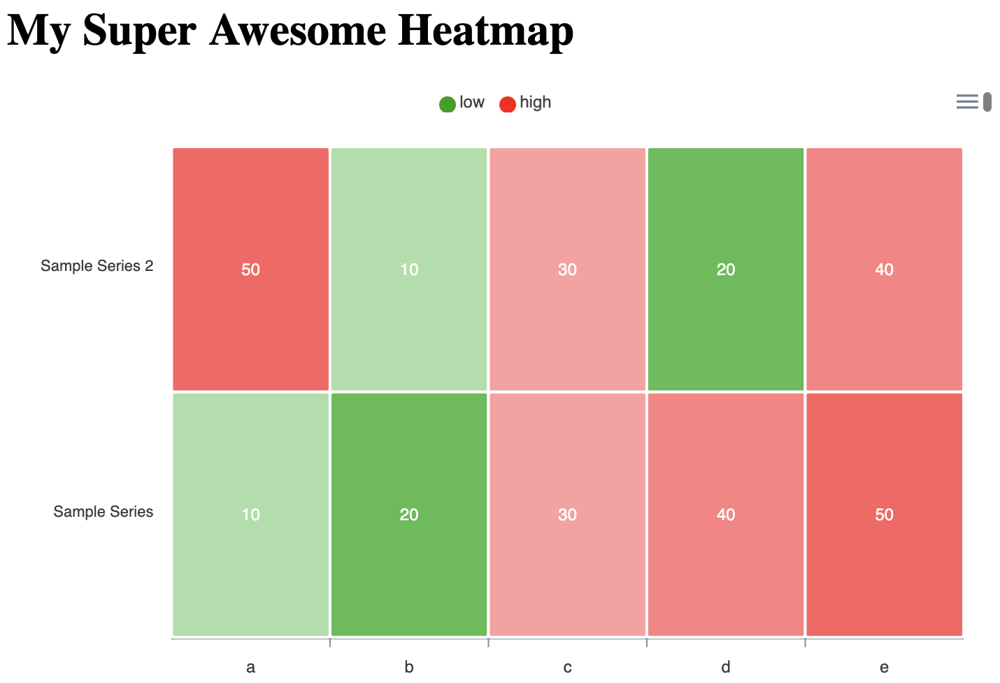
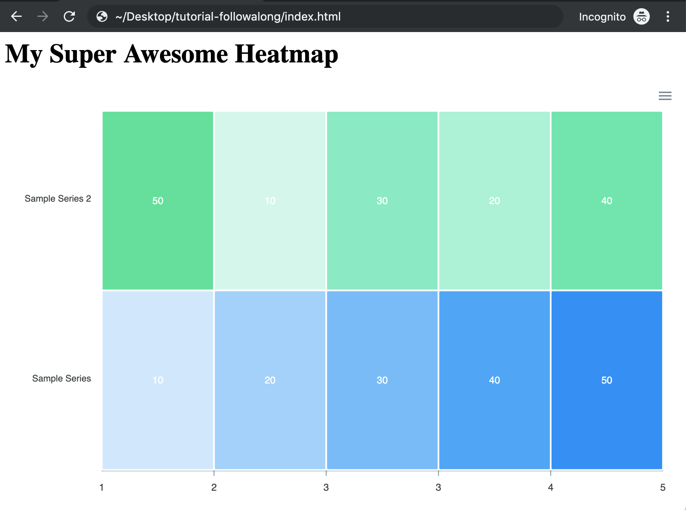

# Getting started

Start with a basic html page.

Create this `index.html` file and open in your browser.

`index.html`
```html
<div id="app">
    <h1>Hello World</h1>
</div>
```

You should see this:


# Mounting the Vue app

Load the Vue library from a content delivery network (CDN) and start your application with `<script>` tags.

```html
<div id="app">
    <h1>{{ message }}</h1>
</div>

<!-- Load the Vue library from a CDN -->
<script src="https://unpkg.com/vue" ></script>

<!-- Start a new Vue instance -->
<script>
  const app = new Vue({
    el: '#app',
  });
</script>
```

The second script tag contains your newly mounted Vue app. This bit of code tells Vue to mount your app on the element with the id "app" (`#app`).

# Making the Vue app reactive

## Changing the message

Add a data object to the Vue instance. Add a data property with the key `message` and enter whatever message you want to replace Hello World.

```html
<script src="https://unpkg.com/vue" ></script>

<script>
  const app = new Vue({
    el: '#app',
    data: {
      message: 'Hello from Vue!'
    },
  });
</script>
```

Bind the message data to your html by replacing the 'Hello World' text with `{{ message }}`.
```html
<div id="app">
    <h1>{{ message }}</h1>
</div>
```

You should now see your text where 'Hello World' used to be:


## Optional: Exploring Data Binding

Open the JavaScript console, and enter `app` to see your instance of Vue. Enter `app.message` to see your custom message.


In your console, reset `app.message` to a new message. The text on your webpage should change to the new message.


Congratulations, you just witnessed Vue reactivity in action! As the data in your Vue instance updates, so does your user interface.

#  Getting Started with ApexCharts

Install the ApexCharts library by adding the following script tags to `index.html`:

```html
<script src="https://cdnjs.cloudflare.com/ajax/libs/apexcharts/3.6.12/apexcharts.js"></script>
<script src="https://cdn.jsdelivr.net/npm/vue-apexcharts"></script>
```

## Registering Components with Vue

Register an apxechart component with Vue before mounting your Vue app. This will give you app access to all of the data visualizations pre-built by ApexCharts.

```html
<script>
  // Register apexchart component
  Vue.component('apexchart', VueApexCharts);

  const app = new Vue({
    el: '#app',
    data: {
      message: 'Hello from Vue!'
    },
  });
</script>
```

Installing the ApexCharts library loaded the Vue `component` object named `apexchart` from `VueApexCharts` into the environment. A `component` is basically a reactive web element with its own html, JavaScript, and styling. You can now use `apexcharts` in your html body just as you would any other element. The difference is that `apexcharts` responds directly to changes in your Vue app.

## Adding a heatmap with HTML and JavaScript

Now that you have registered your component, you can use it in the element where you mounted your Vue app (`#app`). Add the registered `apexcharts` component to your html.

```html
<div id="app">
    <h1>{{ message }}</h1>
    <apexchart type="heatmap" :options="options" :series="series"/>
</div>
```

An apexchart component has at least 3 properties: `type`, `options`, and `series`. The `type` property lets you specify what kind of visualization you would like, such as a heatmap, bar graph, etc. Do you see the colon (`:`) before `options` and `series`? That means these properties will be assigned with JavaScript.

Let's get to the JavaScript then.

Add `options` and `series` properties ot your Vue object. For now, leave options empty, and add some sample heatmap data to `series`.

```html
<script>
  Vue.component('apexchart', VueApexCharts);

  const app = new Vue({
    el: '#app',
    data: {
      // Change to heatmap title
      message: 'My Super Awesome Heatmap',
      // Add heatmap options
      options: {},
      // Add sample heatmap data
      series: [{
        name: 'Sample Series',
        data: [10, 20, 30, 40, 50],
      }]
    },
  });
</script>
```

As you can see here, apexcharts heatmap data should be an array of objects. The entire heatmap is an array, and each track is an object with a `name` and a `data` property.

Save your index.html file and refresh the page.

You should see something like this:


Notice that the colors get progressively darker as the values increase. Looks like the heatmap is working! Let's add a second track to test your new skills.

Add a second track object to the series array with `name` and `data` values of your choosing.
```js
series: [{
        name: 'Sample Series',
        data: [10, 20, 30, 40, 50]
      },
      {
        name: 'Sample Series 2',
        data: [50, 10, 30, 20, 40]
      },]
```

Save and refresh `index.html`. You should see:


Looking good! At the end of the day a heatmap is just data and colors. Now that we've got some data, let's work on our colors.

## Customizing the heatmap
ApexCharts offers a lot of great options for customizing your heatmap to suit your data. Let's start by customizing colors.

To your options data property, add a `plotOptions` with a nested `heatmap` object. This heatmap object is where you will place your customizations for the heatmap display.

```js
      options: {
        // add nested plotOptions object
        plotOptions: {
          // add nested heatmap object
          heatmap: {   
            // customizations will go here
          },
        }
      },
```

### Assigning a Color scale

Let's start by adding a custom color scale. To the `heatmap` object, add another nested object with the `key` colorScale. Give this `colorScale` object a `ranges` object like this:
```js
options: {
  plotOptions: {
      heatmap: {
        colorScale: {
          // custom color range
          ranges: [
          {
            from: 0,
            to: 29,
            color: '#00A100',
            name: 'low',
          },
          {
            from: 30,
            to: 50,
            color: '#FF0000',
            name: 'high',
          },
         ],
        },
    },
```

Save and refresh `index.html`. You should see:


You just classified your data into `low` and `high`, and this immediately gives you a nice sense of the patterns in your data. As you can see, ApexCharts accepts `colorScale` as an array of objects. The `from` and `to` keys assign the lowest and highest values in that color range, `color` is just that, and `name` is an optional property. Can you add a `middle` range and color to your scale?

Here's one way you could do this:
```js
options: {
  plotOptions: {
      heatmap: {
        colorScale: {
          // custom color range
          ranges: [
          {
            from: 0,
            to: 19,
            color: 'green',
            name: 'low',
          },
          {
            from: 20,
            to: 39,
            color: 'yellow',
            name: 'low',
          },
          {
            from: 40,
            to: 50,
            color: 'red',
            name: 'high',
          },
         ],
        },
    },
```

Result:


Congratulations, you have now made and customized a heatmap! This heatmap isn't too meaningful right now though, so let's try using some real data.

## Using Real Data
We'll be making a heatmap of the median rent prices for each neighborhood in Manhattan over the past 5 years. This dataset is from the real estate site StreetEasy (!link).

### Loading the data
Add another script tag, this time to load the rent data.

```html
<script src="https://unpkg.com/vue" ></script>
<script src="https://cdnjs.cloudflare.com/ajax/libs/apexcharts/3.6.12/apexcharts.js"></script>
<script src="https://cdn.jsdelivr.net/npm/vue-apexcharts"></script>
<!-- Load the data -->
<script src="https://annapamma.github.io/vue-heatmap-tutorial/rent-data-62015-62019.js"></script>
```

This JavaScript code loads the variable `rentData` into your local environment.
This rent data is in the format expected by ApexCharts (see [Adding Data to the heatmap](!##adding-data-to-the-heatmap)).

### Updating the data
Your heatmap is all set up. To update the data, just change the `series` value to the `rentData` array you loaded in the previous step.

```js
data: {
    ...
    // Assign rentData to Series
    series: rentData,
  },
});
```

Update the color series to make it a little more meaningful with this data. (We'll fine-tune this later.)

```js
heatmap: {
  colorScale: {
    // Update custom color range
    ranges: [
      {
        from: 500,
        to: 3999,
        color: '#00A100',
        name: 'low',
      },
      {
        from: 4000,
        to: 5999,
        color: '#FFFF00',
        name: 'medium',
      },
      {
        from: 6000,
        to: 8000,
        color: '#FF0000',
        name: 'high',
      },
      ],
    },
  },
}
```

Save index.html and refresh the page in your browser. You should see something like this:


This heatmap is not yet as tidy or expressive as it could be, but even from this very rough draft we can make some conclusions: Central Park South is the most expensive neighborhood in Manhattan and has been for a while (but hey, rent is going from red to yellow!); Flatiron and Tribeca are also painfully pricey. Can you point out any more patterns? Let's make this heatmap nicer to look at.

### More Customizations

#### Customizing the Axes

The labels on data points are messy and uninformative. To take them off, under `options`, add a `dataLabels` object with the key `enabled` set to the value `false`:

```js
// In your Vue data object
data: {
  ...
  options: {
    // Add dataLabels to options
    dataLabels: {
      enabled: false,
    },
    ...
  }
}
```

You should see a pattern now of how to customize the different parts of your heatmap. The ApexCharts component takes a prop `options`, and this `options` object accepts different nested objects for every aspect of your heatmap, including `colorScale` and `dataLabels`. For all of the available options, visit the ApexCharts documentation at https://apexcharts.com/docs/options/.

Save the file and refresh the page. You should see something like this:


That's already looking much better, and we can see the shades more easily. From here we can surmise that on the 'low' end of the data, the neighborhoods of Inwood, Hamilton Heights, and Washington Heights are less expensive.

The x-axis with the date labels is cluttered. Let's clean it up. To show only ever 5 marks, pass this `x-axis` object with specifications to `options`:

```js
options: {
  ...
  xaxis: {
    labels: {
      rotateAlways: true,
      rotate: -45,
      minHeight: 60,
      formatter: function(value, timestamp, index) {
          return index % 5 == 0 ? value : ``;
      },
    },
  },
  ...
}
```
`rotate` and `rotateAlways` ensure that the labels are always at a certain angle to the graph. `minHeight` guarantees a certain height for the labels, so no text is cut off.

`formatter` is a function that takes the value of the x-axis tick, timestamp, and index of the tick then returns the reformatted value. In this function, you set the value for every 5th tick and empty strings for the rest.

Save and refresh the page. You should see something like this:


Hopefully this gives you a sense of how customizable all aspects of the heatmap are. Can you show labels for every 3 months on the x-axis?

One way would be to simply edit the intervals in the x-axis formatter:
```js
formatter: function(value, timestamp, index) {
    return index % 3 == 0 ? value : ``;
},
```

## Last Step: Testing your knowledge
You're an old pro at this by now. How would you get from where you are now to the final product shown below? (Hint: see [Customizing the color scale](#customizing-the-color-scale))

One possible solution:
```js
heatmap: {
  colorScale: {
    // custom color range
    ranges: [
      {
        from: 1500,
        to: 1999,
        color: '#0000ff',
        name: '1500 - 1999',
      },
      {
        from: 2000,
        to: 3999,
        color: '#00A100',
        name: '2000 - 3999',
      },
      {
        from: 4000,
        to: 5999,
        color: '#FFFF00',
        name: '4000 - 5999',
      },
      {
        from: 6000,
        to: 8000,
        color: '#FF0000',
        name: '6000 - 8000',
      },
    ],
  },
}
```

Mission accomplished! Over the course of this tutorial, you have  installed Vue and ApexCharts with content-delivery networks (CDN), instantiated a Vue application, explored the basics of Vue reactivity, displayed and customized a simple heatmap, then made and customized a complex heatmap using real data!

Come back in the near future for the next tutorial, where we will be making our heatmap interactive with ApexCharts' event handlers!
