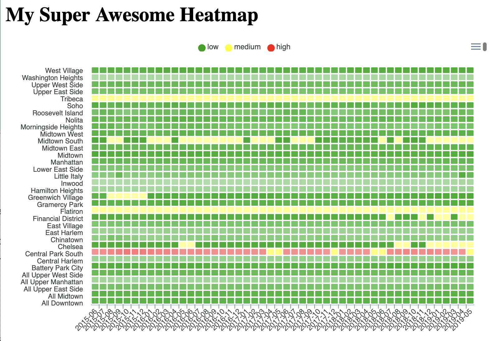

# Hot or Not: Responsive, Cutomizable Heatmaps with Vue.js and ApexCharts

* [Introduction](#introduction)
	* [Audience](#audience)
	* [Goal](#goal)
	* [Outcomes](#outcomes)
	* [Prerequisites](#prerequisites)
* [Getting started](#getting-started)
	* [Starting a basic page](#starting-a-basic-page)
	* [Mounting the Vue app](#mounting-the-vue-app)
* [Starting with Vue reactivity](#starting-with-vue-reactivity)
	* [Changing the message](#changing-the-message)
	* [Optional: Exploring Data Binding](#optional-exploring-data-binding)
* [Getting Started with ApexCharts](#getting-started-with-apexcharts)
	* [Loading ApexCharts](#loading-apexcharts)
	* [Registering the component](#registering-the-component)
	* [Adding the component to the page](#adding-the-component-to-the-page)
* [Working with data](#working-with-data)
	* [Basic structure of ApexCharts data](#basic-structure-of-apexcharts-data)
	* [Adding more tracks](#adding-more-tracks)
	* [Specifying y-axis and x-axis labels](#specifying-y-axis-and-x-axis-labels)
* [Customizing the heatmap](#customizing-the-heatmap)
	* [Basic structure of ApexCharts options](#basic-structure-of-apexcharts-options)
	* [Assigning a color scale](#assigning-a-color-scale)
* [Using Real Data](#using-real-data)
	* [Loading the data](#loading-the-data)
	* [Updating the heatmap](#updating-the-heatmap)
* [More Customizations](#more-customizations)
	* [Customizing the data points](#customizing-the-data-points)
	* [Customizing the x-axis](#customizing-the-x-axis)
* [Last Step: Testing your knowledge](#last-step-testing-your-knowledge)


# Introduction
## Audience
This tutorial is designed for software and web developers who want to learn the basics of implementing customized heatmaps with Vue.js and ApexCharts.

## Goal
We'll be making a heatmap of the median rent prices for each neighborhood in Manhattan over the past 5 years.


You may be alarmed by the rents, but do not be alarmed by the task. We'll be working through this step-by-step, starting with a smaller heat map and building up to this endpoint.

## Outcomes
By the end of this tutorial, you will be adequately familiar with the structure and function of ApexCharts heatmaps to customize your applications to fit your own data visualization needs.

## Prerequisites
Readers should have a working familiarity with HTML and JavaScript, access to a browser, and an active Internet connection.

# Getting started

## Starting a basic page

Create an `index.html` file with these contents:

```html
<div id="app">
    <h1>Hello World</h1>
</div>
```

Save the file and open in your browser. You should see this:


See it on codepen: https://codepen.io/annapamma/pen/KOMdzW

## Mounting the Vue app
Load the Vue library from a content delivery network (CDN) and start your application with `<script>` tags.

```html
<div id="app">
    <h1>{{ message }}</h1>
</div>

<!-- Load the Vue library from a CDN -->
<script src="https://unpkg.com/vue" ></script>

<!-- Start a new Vue instance -->
<script>
  const app = new Vue({
    el: '#app',
  });
</script>
```

The second script tag contains your newly mounted Vue app. This bit of code tells Vue to mount your app on the element with the id "app" (`#app`).

See it on codepen: https://codepen.io/annapamma/pen/OKXyRy

# Starting with Vue reactivity

## Changing the message

Add a data object to the Vue instance. Add a data property with the key `message` and enter whatever message you want to replace Hello World.

```html
<script src="https://unpkg.com/vue" ></script>

<script>
  const app = new Vue({
    el: '#app',
    //  Add data object
    data: {
      message: 'Hello from Vue!'
    },
  });
</script>
```

Bind the message data to your html by replacing the 'Hello World' text with `{{ message }}`.
```html
<div id="app">
    <!-- Change the hard-coded text to a variable -->
    <h1>{{ message }}</h1>
</div>
```

Save `index.html` and refresh the page in your browser. You should now see your text where 'Hello World' used to be:


See it on codepen: https://codepen.io/annapamma/pen/aeZvLQ

## Optional: Exploring Data Binding

Open the JavaScript console in your browser (Cmd + Option + J on a Mac or Cmd +Shift + J on Windows), and enter `app` to see your instance of Vue. Enter `app.message` to see your custom message.


In your console, reassign `app.message` to a new message. The text on your webpage should change to the new message.


Congratulations, you just witnessed Vue reactivity in action! As the data in your Vue instance updates, so does your user interface. Herein lies the power of today's progressive JavaScript frameworks. Let's contrast this to how you would do it with vanilla JavaScript:

```js
let h1WithMessage = document.getElementsByTagName('h1')[0];
h1WithMessage.textContent = 'Made with vanilla JS'
```

See this on codepen: https://codepen.io/annapamma/pen/ymJJRK

With a library like jQuery or vanilla JavaScript, you are pulling out the document element and updating the inner HTML. This imperative type of programming ('do this then this') can get very messy very quickly. With an organized, reactive framework like Vue, you simply assign your data, and the associated part of the document is updated for you.

#  Getting Started with ApexCharts

## Loading ApexCharts
Install the ApexCharts library by adding the following script tags to `index.html`:

```html
<script src="https://unpkg.com/vue" ></script>
<!-- Right after the line where you loaded Vue, add the script tags for apexcharts and vue-apexcharts -->
<script src="https://cdnjs.cloudflare.com/ajax/libs/apexcharts/3.6.12/apexcharts.js"></script>
<script src="https://cdn.jsdelivr.net/npm/vue-apexcharts"></script>
```

See it on codepen: https://codepen.io/annapamma/pen/LwZpOv

## Registering the component

In the script element where you mounted your Vue app, register an apxechart component with Vue before calling `new Vue`.

```html
<script>
  // Register apexchart component
  Vue.component('apexchart', VueApexCharts);

  const app = new Vue({
    el: '#app',
    data: {
      message: 'Hello from Vue!'
    },
  });
</script>
```

Installing the ApexCharts library loaded the Vue component object named `apexchart` from `VueApexCharts` into the environment. A component is basically a reactive web element with its own html, JavaScript, and styling. You can now use `apexcharts` in your html body just as you would any other element. The difference is that `apexcharts` responds directly to changes in your Vue app.

See it on codepen: https://codepen.io/annapamma/pen/oKLjdr

## Adding the component to the page

Now that you have registered your component, you can use it in the element where you mounted your Vue app (`#app`). Add the registered `apexcharts` component to your html.

```html
<div id="app">
    <h1>{{ message }}</h1>
    <!-- Insert apexchart component into the document -->
    <apexchart type="heatmap" :options="options" :series="series"/>
</div>
```

An `apexchart` component has at least 3 properties: `type`, `options`, and `series`. The `type` property lets you specify what kind of visualization you would like, such as a heatmap, bar graph, etc. Do you see the colon (`:`) before `options` and `series`? That means these properties will be assigned with JavaScript from your Vue application data.

See it on codepen: https://codepen.io/annapamma/pen/WVxQKE

# Working with data

## Basic structure of ApexCharts data
Add `options` and `series` properties to your Vue `data` object. For now, leave `options` empty, and add some sample heatmap data to `series`.

```html
<script>
  Vue.component('apexchart', VueApexCharts);

  const app = new Vue({
    el: '#app',
    data: {
      // Change to heatmap title
      message: 'My Super Awesome Heatmap',
      // Add heatmap options, leave empty for now
      options: {},
      // Add sample heatmap data
      series: [{
        name: 'Sample Series',
        data: [10, 20, 30, 40, 50],
      }]
    },
  });
</script>
```

As you can see here, ApexCharts heatmap data should be an array of objects. The entire heatmap is an array, and each track is an object with a `name` and a `data` property.

Save your index.html file and refresh the page.

You should see something like this:


Notice that the colors get progressively darker as the values increase. Looks like the heatmap is working! Let's add a second track to test your new skills.

See it on codepen: https://codepen.io/annapamma/pen/EqyPKq

## Adding more tracks
Add a second track object to the series array with `name` and `data` values.
```js
data: {
  ...
  series: [
    {
      name: 'Sample Series',
      data: [10, 20, 30, 40, 50]
    },
    // Add second track
    {
      name: 'Sample Series 2',
      data: [50, 10, 30, 20, 40]
    },
  ],
}

```

Save and refresh `index.html`. You should see something like this:


See it on codepen: https://codepen.io/annapamma/pen/LwZGRp

## Specifying y-axis and x-axis labels
Give your data points both x-axis and y-axis labels by restructuring the `data` value of each track from an array of individual values to an array of objects with `x` and `y` properties.
```js
// Series is an array of objects
series: [
  {
    name: 'Sample Series',
    // Give data points 'x' and 'y' properties
    data: [
      {x: 'a', y: 10},
      {x: 'b', y: 20},
      {x: 'c', y: 30},
      {x: 'd', y: 40},
      {x: 'e', y: 50}
    ]
  },
  {
    name: 'Sample Series 2',
    // Data for each track is an array of objects
    data: [
      {x: 'a', y: 50},
      {x: 'b', y: 10},
      {x: 'c', y: 30},
      {x: 'd', y: 20},
      {x: 'e', y: 40}
    ]
  },
]
```

Save and refresh your page. You should see something like this:


Notice that the x-axis now has the labels you assigned.

# Customizing the heatmap

## Basic structure of ApexCharts options
ApexCharts offers a lot of great options for customizing your heatmap to suit your data. Let's start by customizing colors.

To your options data property, add a `plotOptions` with a nested `heatmap` object. This heatmap object is where you will place your customizations for the heatmap display.

```js
data: {
  ...
  options: {
    // Add nested plotOptions object
    plotOptions: {
      // Add nested heatmap object
      heatmap: {   
        // Customizations will go here
      },
    }
  },
  ...
}

```

See it on codepen: https://codepen.io/annapamma/pen/MNeypK

## Assigning a color scale

Let's start by adding a custom color scale. To the `heatmap` object, add another nested object with the `key` colorScale. Give this `colorScale` object a `ranges` object like this:
```js
plotOptions: {
    heatmap: {
      colorScale: {
        // custom color range
        ranges: [{
          from: 0,
          to: 29,
          color: '#00A100',
          name: 'low',
        },
        {
          from: 30,
          to: 50,
          color: '#FF0000',
          name: 'high',
        }],
      },
  },
},
```

Save and refresh `index.html`. You should see:


You just classified your data into `low` and `high`, and this immediately gives you a nice sense of the patterns in your data. As you can see, ApexCharts accepts `colorScale` as an array of objects. Can you add a `middle` range and color to your scale?

See it on codepen: https://codepen.io/annapamma/pen/MNeypK

Here's one way you could do this:
```js
plotOptions: {
    heatmap: {
      colorScale: {
        // Custom color range
        ranges: [
        {
          from: 0,
          to: 19,
          color: '#00A100',
          name: 'low',
        },
        // Add a middle range
        {
          from: 20,
          to: 39,
          color: '#FFFF00',
          name: 'medium',
        },
        {
          from: 40,
          to: 50,
          color: '#FF0000',
          name: 'high',
        },
       ],
      },
  },
},
```

Result:


See it on codepen: https://codepen.io/annapamma/pen/OKXNgq

Congratulations, you have now made and customized a heatmap! At this point, you have learned the basics for making a heatmap: assigning data and applying colors.

This heatmap isn't too meaningful right now though, so let's try using some real data.

# Using Real Data
We'll be making a heatmap of the median rent prices for each neighborhood in Manhattan over the past 5 years. This dataset is from the real estate site [StreetEasy](https://streeteasy.com/blog/data-dashboard/).

## Loading the data
Add another script tag, this time to load the rent data.

```html
<script src="https://cdnjs.cloudflare.com/ajax/libs/apexcharts/3.6.12/apexcharts.js"></script>
<!-- After loading ApexCharts, load the data -->
<script src="https://annapamma.github.io/vue-heatmap-tutorial/rent-data-62015-62019.js"></script>
```

This JavaScript code loads the variable `rentData` into your local environment.
This rent data is in the format expected by ApexCharts (see [Basic structure of ApexCharts data](!#basic-structure-of-apexcharts-data). Make sure you load this before the `script` tag where you mount your Vue app, so your app can access `rentData`.

See it on codepen: https://codepen.io/annapamma/pen/RXRaLY

## Updating the heatmap
Your heatmap is all set up. To update the data, just change the `series` value to the `rentData` array you loaded in the previous step.

```js
data: {
    ...
    // Replace fake data with rentData
    series: rentData,
  },
});
```

Update the color series to make it a little more meaningful with this data. (We'll fine-tune this later.)

```js
heatmap: {
  colorScale: {
    // Update custom color range
    ranges: [
      {
        from: 500,
        to: 3999,
        color: '#00A100',
        name: 'low',
      },
      {
        from: 4000,
        to: 5999,
        color: '#FFFF00',
        name: 'medium',
      },
      {
        from: 6000,
        to: 8000,
        color: '#FF0000',
        name: 'high',
      },
    ],
  },
},
```

Save index.html and refresh the page in your browser. You should see something like this:


See it on codepen: https://codepen.io/annapamma/pen/pMbydj

This heatmap is not yet as tidy or expressive as it could be, but even from this very rough draft we can make some conclusions: Central Park South is the most expensive neighborhood in Manhattan and has been for a while (but hey, rent is going from red to yellow!); Flatiron and Tribeca are also painfully pricey. Can you point out any more patterns? Let's make this heatmap more informative and consequently nicer to look at.

# More Customizations

## Customizing the data points

The labels on data points are messy and uninformative. To take them off, under `options`, add a `dataLabels` object with the key `enabled` set to the value `false`:

```js
// In your Vue data object
data: {
  ...
  options: {
    // Add dataLabels to options
    dataLabels: {
      enabled: false,
    },
    ...
  }
}
```

You should see a pattern now of how to customize the different parts of your heatmap. The ApexCharts component takes a prop `options`, and this `options` object accepts different nested objects for every aspect of your heatmap, including `colorScale` and `dataLabels`. For all of the available options, visit the ApexCharts documentation at https://apexcharts.com/docs/options/.

Save the file and refresh the page. You should see something like this:


See it on codepen: https://codepen.io/annapamma/pen/ZgOWrp

That's already looking much better, and we can see the shades more easily. From here we can surmise that on the 'low' end of the data, the neighborhoods of Inwood, Hamilton Heights, and Washington Heights are less expensive.

## Customizing the x-axis
The x-axis with the date labels is cluttered. Let's clean it up. To show only every 5 months, add this `x-axis` object to `options`:

```js
options: {
  ...
  // Add x-axis object
  xaxis: {
    labels: {
      rotateAlways: true,
      rotate: -45,
      minHeight: 60,
      formatter: function(value, timestamp, index) {
          return index % 5 == 0 ? value : ``;
      },
    },
  },
  ...
}
```
`rotate` and `rotateAlways` ensure that the labels are always at a certain angle to the graph. `minHeight` guarantees a certain height for the labels, so no text is cut off.

`formatter` is a function that takes the value of the x-axis tick, timestamp, and index of the tick then returns the reformatted value. In this function, you set the value for every 5th tick and empty strings for the rest.

Save and refresh the page. You should see something like this:


See it on codepen: https://codepen.io/annapamma/pen/YmWqej

Hopefully this gives you a sense of how customizable all aspects of the heatmap are. Can you show labels for every 3 months on the x-axis?

One way would be to simply edit the intervals in the x-axis formatter:
```js
formatter: function(value, timestamp, index) {
    return index % 3 == 0 ? value : ``;
},
```
See it on codepen: https://codepen.io/annapamma/pen/qeNZox

To see more options, including customizing the y-axis and styling, view the ApexCharts options documentation at https://apexcharts.com/docs/options/.

# Last Step: Testing your knowledge
You're an old pro at this by now. How would you get from where you are now to the final product shown below? (Hint: see [Assigning a color scale](#assigning-a-color-scale))


Fine-tune your color scale as follows:
```js
heatmap: {
  colorScale: {
    // Updated custom color range
    ranges: [
      {
        from: 1500,
        to: 1999,
        color: '#0000ff',
        name: '1500 - 1999',
      },
      {
        from: 2000,
        to: 3999,
        color: '#00A100',
        name: '2000 - 3999',
      },
      {
        from: 4000,
        to: 5999,
        color: '#FFFF00',
        name: '4000 - 5999',
      },
      {
        from: 6000,
        to: 8000,
        color: '#FF0000',
        name: '6000 - 8000',
      },
    ],
  },
}
```

See it on codepen: https://codepen.io/annapamma/pen/PMzNeg

Mission accomplished! Over the course of this tutorial, you have  installed Vue and ApexCharts with content-delivery networks (CDN), instantiated a Vue application, explored the basics of Vue reactivity, displayed and customized a simple heatmap, then made and customized a complex heatmap using real data!

Now go forth and heat things up! Try changing the title, the shapes of the data points, what-have-you by adding the options found in the [ApexCharts docs](https://apexcharts.com/docs/options/). Send your lovely custom heatmaps to me at anna.pamela@gmail.com, and I'll include them in a gallery.

Come back in the near future for the next tutorial, where we will be making our heatmap interactive with ApexCharts' event handlers!
